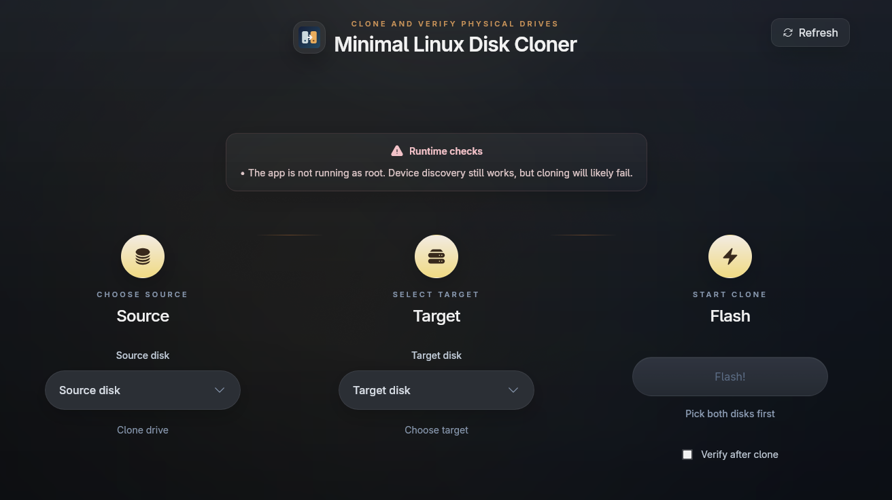

# Minimal Linux Disk Cloner

Minimal Linux Disk Cloner is a Linux-only desktop app for direct disk-to-disk cloning with `dd`.



Current version: `0.1.0`

It is intentionally narrow in scope: choose a source drive, choose a target drive, review warnings, clone, optionally verify, and get a readable final result. It is not a backup suite, image manager, or partition editor.

## Why this exists

`dd` is powerful, fast, and dangerous. The goal of this app is not to replace it, but to make the workflow easier to read and harder to mess up by accident.

The app focuses on:

- clear source and target selection
- readable device metadata
- warnings for risky choices
- live progress during cloning
- optional post-clone verification
- a clean success or failure result

## Current feature set

- Linux disk discovery via `lsblk -J`
- single-screen source / target / clone flow
- custom device pickers with visible size, model, removable, and mounted indicators
- warnings for dangerous or suspicious clone setups
- real `dd` execution with live progress parsing
- optional full-device verification after clone
- guarded stop action during clone or verification
- pre-flight device revalidation immediately before starting
- text run report export after completion
- fake development mode for UI and workflow testing without root or real disks

## Safety and scope

This is a destructive tool.

- the target drive is overwritten
- the app does not try to outsmart `dd`
- smaller targets are warned about, not silently corrected
- mounted devices are warned about because the clone may be inconsistent or dangerous

The app currently supports:

- Linux only
- disk-to-disk cloning only

It does not currently support:

- image files
- compression
- partition resizing
- filesystem-aware copy
- backup/archive workflows

## Runtime requirements

- Linux
- `lsblk` available in `PATH`
- `dd` available in `PATH`
- root privileges for real cloning and verification

You can still run the app without root for device discovery and UI checks, but starting a real clone will fail.

## Running the app

Install dependencies:

```bash
npm install
```

Run the desktop app in normal development mode:

```bash
npm run tauri:dev
```

For actual real-device testing, build the debug app and run the binary with `sudo`:

```bash
npm run tauri:build -- --debug
sudo ./src-tauri/target/debug/mldc-tauri
```

## Fake development mode

For most UI work, fake mode is the right workflow:

```bash
npm run tauri:dev:fake
```

Fake mode:

- does not use `lsblk`
- does not require root
- does not invoke `dd`
- simulates clone progress
- simulates optional verification

Use fake mode for:

- layout and styling
- modals and interactions
- progress and result screens
- warning presentation
- report export flow

Use real mode for:

- actual device discovery
- `dd` execution
- verification against real drives
- stop behavior against a real subprocess

## Build commands

Frontend build:

```bash
npm run build
```

Desktop bundle:

```bash
npm run tauri:build
```

## Project structure

- `src/` — React frontend, styling, and app flow
- `src-tauri/` — Rust backend for device discovery, warnings, cloning, verification, and Tauri commands
- `assets/` — app assets
- `packaging/linux/` — Linux desktop entry template

## Development notes

The frontend is built with:

- React
- Vite
- Tailwind CSS
- Framer Motion
- `react-icons`

The backend is built with:

- Rust
- Tauri
- `lsblk` for disk discovery
- `dd` for cloning

## Status

The app is already usable for the core workflow:

- select source
- select target
- clone
- verify if needed
- export a run report

The current emphasis is polishing the UI, tightening safety signals, and refining the Linux desktop workflow.
